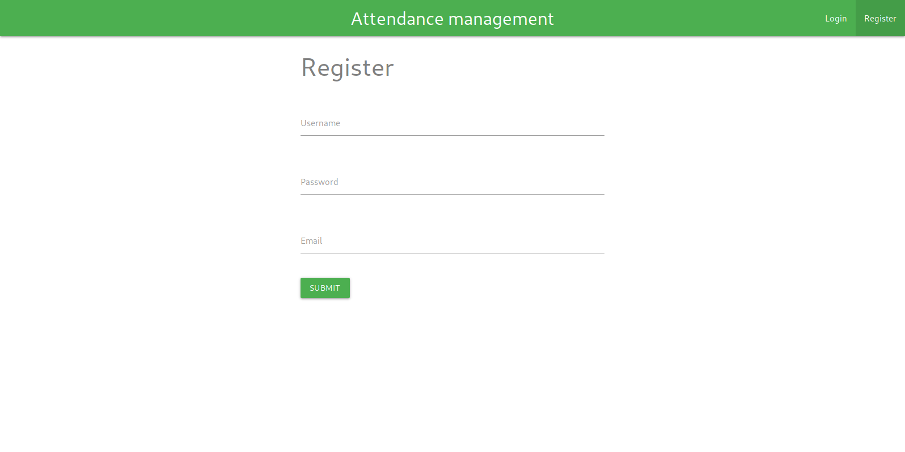
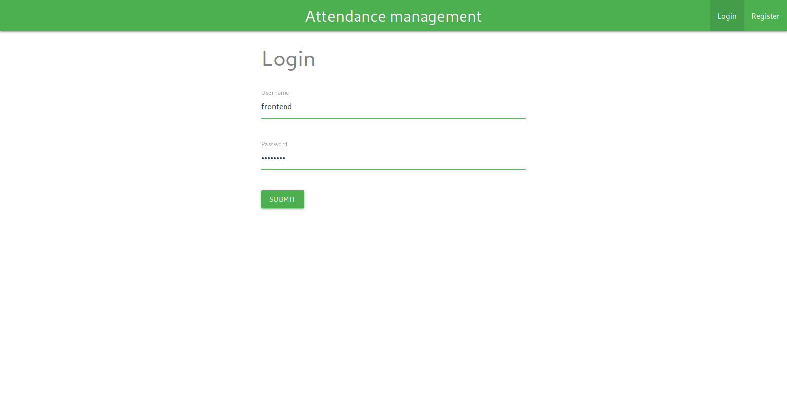
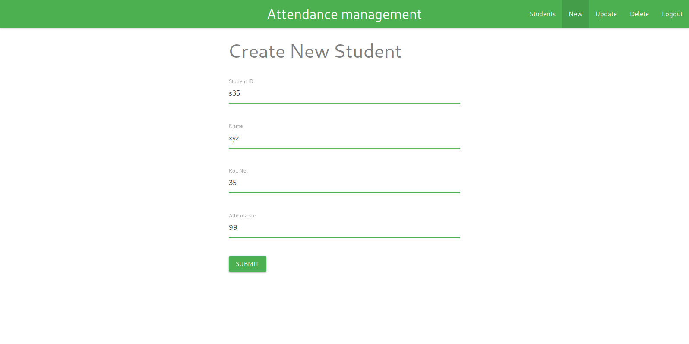
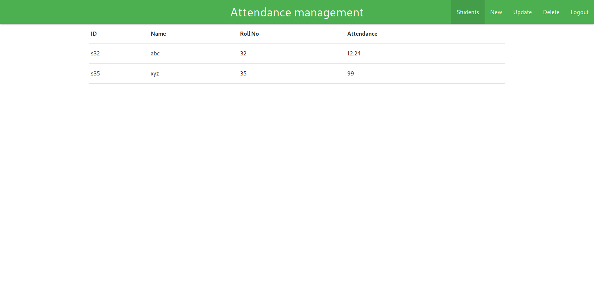

# Student attendance management system

> Students attendance management system written with rust backend and vuejs frontend

[](https://travis-ci.com/akhilkpdasan/rs-attendance)
[](https://ci.appveyor.com/project/akhilkpdasan/rs-attendance)

# Motivation

This is a toy project built for learning purpose.

# Screenshots

Register             |  Login
:-------------------------:|:-------------------------:
  |  

New student             |  View students
:-------------------------:|:-------------------------:
  |  

# Tech/Frameworks used
- actix-web (Backend)
- vuejs (Frontend)
- PostgreSQL (Database)


# Installation

Clone the repo:
```
$ git clone git@github.com:akhilkpdasan/rs-attendance.git
```
or download [zip]( https://github.com/akhilkpdasan/rs-attendance/archive/master.zip) file and unzip


## Setup backend

### Install `rustup`. [See](https://www.rust-lang.org/en-US/other-installers.html)
> rustup installs rustc, cargo, rustup and other standard tools to Cargo's bin directory.

Once rustup is installed run this command to make sure everything works.
```
$ rustc --version
```
Note: On windows Microsoft Visual Studio 2015+ is required [Download](https://www.microsoft.com/en-us/download/details.aspx?id=48145)


### Install `PostgreSQL` Database. [See](https://www.postgresql.org/download/)


Now we are ready to create database, tables and start backend server.
We can use `diesel_cli` to manage database.

```
$ cd rs-attendance
$ cargo install diesel_cli
$ diesel setup
$ diesel migration run
$ cargo run
```


## Setup frontend Server

### Install `nodejs`. [See](https://nodejs.org/en/download/)
> Node.js is a JavaScript runtime built on Chrome's V8 JavaScript engine.

### Start frontend server

```
$ npm install yarn
$ cd webapp
$ yarn install
$ yarn run dev
```

The website should now be available on `http://localhost:8080`


# Tests

To run tests on backend
```
$ cargo test
```

To run tests on frontend
```
$ cd webapp
$ yarn test
```
